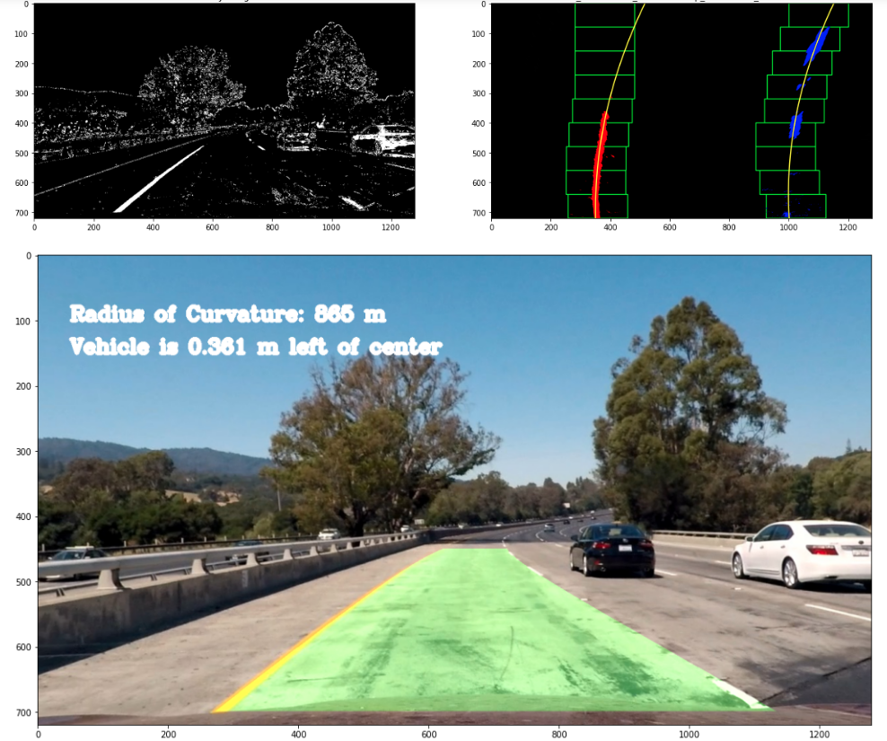

# Advanced Lane Finding Project

[//]: # (Image References)

[image1]: output_images/calib_result.jpg "calibration"
[image2]: output_images/prespective_result.jpg "warp"
[image3]: output_images/poly_fit_result.jpg "polyfit"
[image4]: output_images/poly_fit_2_result.jpg "polyfit2"
[image5]: output_images/test3_result.jpg "binay"

This repository contains the codes for lane detection in images and videos. The following processes are sequentially peformed on an input image/video frame:

* Compute the camera calibration matrix and distortion coefficients given a set of chessboard images.
* Apply a distortion correction to raw images.
* Use color transforms, gradients, etc., to create a thresholded binary image.
* Apply a perspective transform to rectify binary image ("birds-eye view").
* Detect lane pixels and fit to find the lane boundary.
* Determine the curvature of the lane and vehicle position with respect to center.
* Warp the detected lane boundaries back onto the original image.
* Output visual display of the lane boundaries and numerical estimation of lane curvature and vehicle position.

In what follows, I will briefly describe the code and its main components

## 1. Camera calibration

A series of checker board pictures are used to calibrate the distortion of the camera. The locations of checker board corners are detected using `cv2.findChessboardCorners`, which is later used to obtain camera parameters using the `cv2.calibrateCamera` function. The code is provided in the Section 2.1 of provided jupyter notebook (Advanced_lane_detection.ipynb) and a sample result of it for undistort camera images using `cv2.undistort` is depicted here:

![alt text][image1]

## 2. Thresholding to create binary mask

Four measures based on gray scaled gradient directions and one measure based on saturation channel in HLS color space is used to create a binary mask which isolates lane markings. Additionally a region of interest mask is used to further eliminate unnecessary artifacts. This code is implemented in Section 2.2 of the notebook. As example of this process is provided in the following figure where the stacked thresholds (middle figure) shows XY gradients, magnitude and directional gradients, and saturation components of the applied thresholding in the red, green, and blue channels respectively.

![alt text][image5]

## 3. Perspective transformation

This code converts the camera inputs to a birds-eye view in Section 2.3. Mapping points are manually selected to make straight lanes lines parallel in the tranformed view. Selected points are reported in the following table and an example of warped image is provided as well.

| Source        | Destination   | 
|:-------------:|:-------------:| 
| 590, 450      | 320, 0        | 
| 230, 700      | 320, 720      |
| 1080, 700     | 960, 720      |
| 690, 450      | 960, 0        |

![alt text][image2]

## 4. Fit polynomial lines
Two cases are implemented in Section 2.4 for polynomial fitting. In the first case, we perform a complete search for finidng the line, whereas in the second case, we use the previously found line coefficients to guild the search. 

In the first senario, we produce a histogram of the bottom half of the image and select bases of left and right lanes as the points with maximum values. Later, we use a number of windows starting from the bottom of the image to find active pixels in the vicinity of our search windows. The selected points are then used to fit a second order polynomial using `np.polyfit` function. A demonstration of this process can be seen here:

![alt text][image3]

In the second senario, we perform the search within a margin of previously obtained lines, as can be seen in the follwoing figure.

![alt text][image4]

## 5. Curvature and offset calculation

The line coefficients are transformed from the pixel space to the meters and used to calcualate the curvature of both left and right lanes as well as the offset of the middle of the camera image from the middle of the lanes. Additionally, we keep track of the distance between the lanes in the top and bottom of the image, which is later used to sanity check the calculations. This functionality is implemented in `compute_curv_offset` function in the notebook.

## 6. Visualization

A polygon is created as the result of the two left and right lanes. This polygon is warped back into the perspective view using the inverse transformation matrix obtained earlier. Additionally, the radius of curvature and position of the vehicle with respect to the middle of the lanes are plotted on top of the image. This code is implemented in `overlay_results` function in the notebook, which results in the first figure on top of this file.

## 7. Solution validation

Finally, four metrics are used to check the validity of the polynomial lines including the difference between left and right lane curvatures, consistency of lane width, consistency of vehicle offset with previous steps, and consistency of curvature with previous steps. Additionally, we keep track of a running average of the solutions for a smoother transition. This code within Section 3 of the notebook.

## Usage
Run the cells in the jupyter notebook, Advanced_lane_detection.ipynb, in the provided order.

## Future imporvements

* Better thresholding of colors especially yellows

* Adjusting hypyerparameters including thresholds and search margins

* Adaptation to sharp turns

