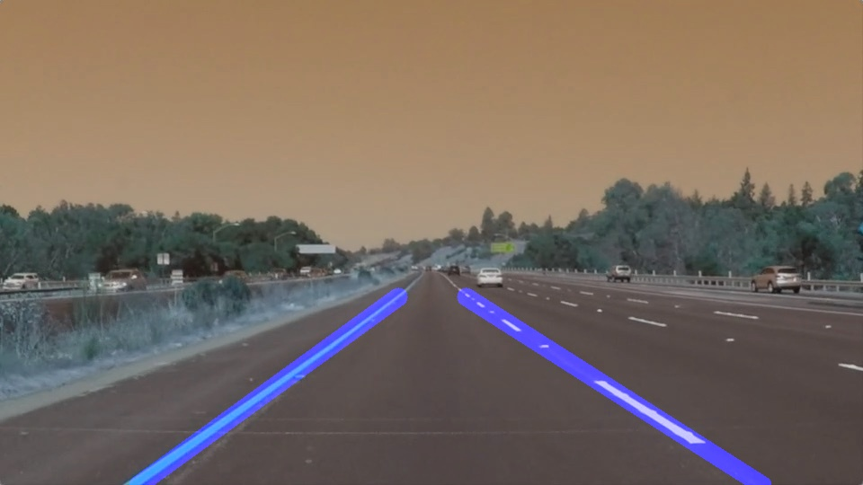

# Lane detection using classical computer vision methods

This repository contains the codes for lane detection in images and videos. The following processes are sequentially peformed on an input image/video frame:
1. gray scaling the image (needed for subsequent edge detection)
2. gaussian blur to reduce noise
3. canny edge detection
4. masking the region of interest
5. hough line detection
6. averaging hough lines to detect one right and one left lane.

## Usage
Run the cells in the jupyter notebook, lane_detection.ipynb, in the provided order.

## Shortcomings
* Current code is highly sensitive to road curvature, lane markings syles, lighting conditions, and weather.

* As each video frame is processed indepedently, we neglect a potentially important source of information, i.e. the temporal correlation between lanes.

* This approach lacks the capability to infer lane boundaries in streets/highways with low quality or no lane markings.

## Future imporvements

* Implement adaptive contrasting and masking for better generalization.

* Using previous frames' lanes as a prior for future lanes

* Infer lanes based on the overall shape of the road.

